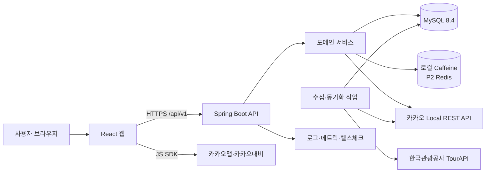
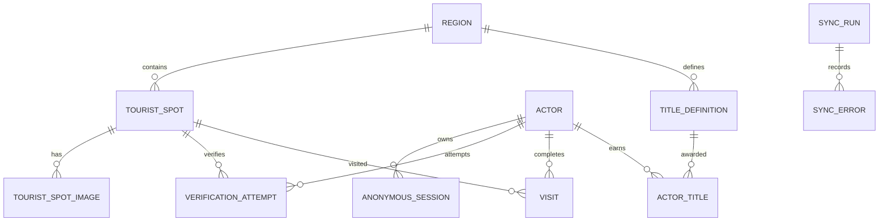
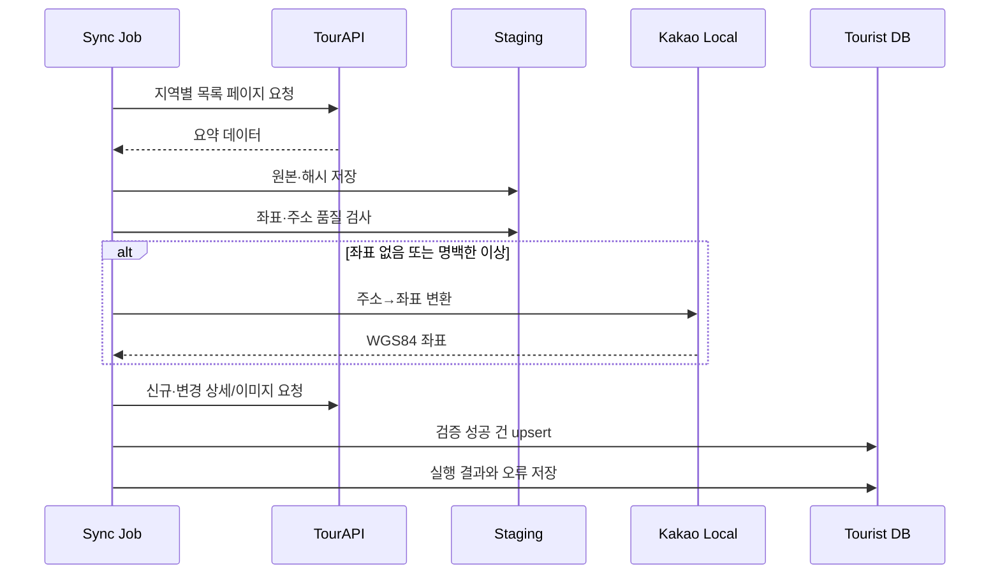
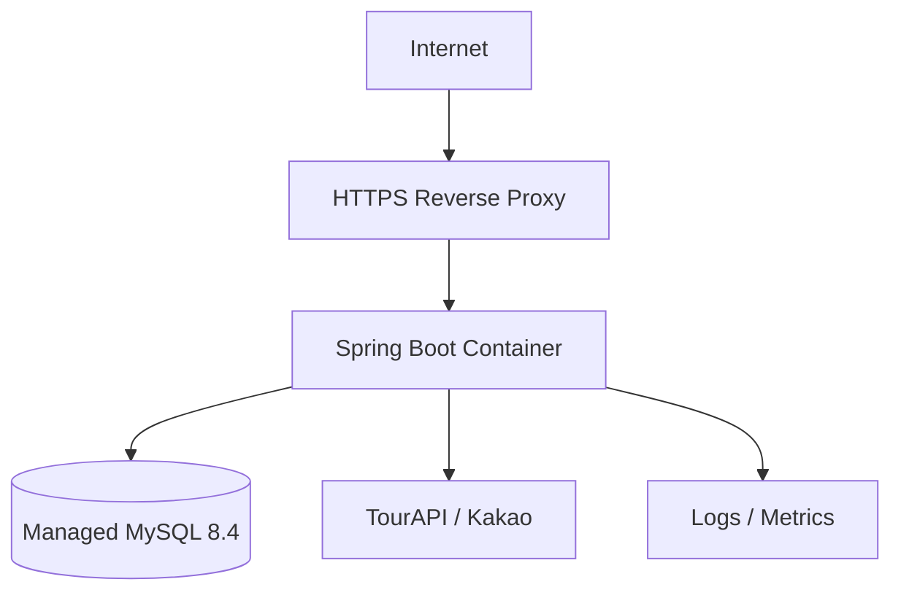

# 다녀감 백엔드 설계서

> GPS 위치 인증과 관광데이터를 활용한 역사유적 스탬프 관광 서비스  
> 문서 버전: v1.0  
> 작성일: 2026-08-29  
> 대상 독자: 백엔드, 프론트엔드, 디자인, 기획

## 1. 문서 목적과 기준

이 문서는 `다녀감_상세_기능정의서.pdf`와 공모전 제안서 HWP의 서비스 내용을 백엔드 구현 관점으로 구체화한 신규 설계 문서다. 원본 PDF와 HWP는 변경하지 않는다.

이 문서의 표현은 다음 의미를 갖는다.

| 표기 | 의미 |
|---|---|
| 확정 | 원본 기능 정의서 또는 공모전 양식에서 요구한 사항 |
| 권장 | 구현 가능성과 안정성을 고려한 백엔드 설계 제안 |
| TBD | 기획·백엔드·프론트·디자인 합의 전에는 운영값으로 확정하면 안 되는 사항 |

공모전 제출 제안서는 양식 수정 금지, 모든 항목 작성, 5페이지 이내, 12포인트 이상, PDF 10MB 미만의 제약이 있다. 이 백엔드 설계서는 개발 협업용이므로 해당 5페이지 제한의 대상이 아니다.

### 1.1 설계 목표

- 관광공사 OpenAPI 데이터를 자체 DB에 적재해 지도 조회 속도와 장애 대응력을 확보한다.
- 지도용 경량 조회와 관광지 상세 조회를 분리한다.
- Bounding Box 공간 검색으로 현재 화면 안의 관광지만 반환한다.
- GPS 인증 판정과 스탬프 중복 방지를 서버가 책임진다.
- 프론트에 외부 API의 비밀키를 노출하지 않는다.
- P0를 먼저 완성하고, P1/P2가 추가되어도 핵심 모델을 갈아엎지 않게 한다.
- 프론트와 디자인이 API 상태만으로 로딩·성공·실패·부분 실패 화면을 설계할 수 있게 한다.

### 1.2 기능 범위

| 단계 | 백엔드 범위 |
|---|---|
| P0 | TourAPI 수집, 좌표 정제, 지도 영역 조회, 관광지 상세, 현재 주소, 주변 주차장, GPS 인증, 스탬프 저장, 익명 사용자 세션, 배포·관측 |
| P1 | 팔도 도감, 지역별 진행률, 칭호 |
| P2 | 이동 영역 마킹, 월별 자동 동기화 고도화, Redis 캐시 |
| 프론트 책임 | 기기 GPS 권한·좌표 획득, 카카오맵 렌더링, 마커 클러스터링, 카카오내비 실행 |

## 2. 선결정 사항

원본 문서의 TBD를 임의로 확정하지 않는다. 아래 권장안은 구현 방향이며, 운영값은 팀 합의 후 환경변수 또는 관리 데이터로 주입한다.

| 항목 | 권장안 | 구현상 보호 장치 | 최종 결정자 |
|---|---|---|---|
| GPS 인증 반경 | 현장 테스트 후 공통 기본값 + 관광지별 예외값 | 운영 프로필에 기본값 없음. 미설정 시 서버 시작 실패 | 기획+백엔드 |
| GPS 허용 정확도 | 반경과 함께 기기별 현장 테스트 | `maxAccuracyMeters` 설정값 사용 | 기획+백엔드 |
| 위치 측정 유효시간 | 인증 직전에 측정된 좌표만 허용 | `maxLocationAgeSeconds` 설정값 사용 | 기획+백엔드 |
| 스탬프 대상 관광지 | 기획이 승인한 목록을 CSV/관리 데이터로 적재 | TourAPI 분류만으로 자동 선정하지 않음 | 기획 |
| 중복 방문 | 스탬프는 장소당 최초 1회, 재시도 결과는 멱등 응답 | DB 유니크 제약으로 중복 지급 차단 | 기획+백엔드 |
| 사용자 식별 | P0는 익명 세션, 추후 로그인 계정에 병합 | `actor` 추상화로 익명/회원 공통 처리 | 기획+백엔드 |
| 공영주차장 출처 | 공영 여부가 검증된 공공데이터를 1순위로 선정 | 출처가 미확정이면 화면 문구를 `주변 주차장`으로 제한 | 기획+백엔드 |
| 도감 범위 | P1은 스탬프 대상 관광지만 집계 | 집계 정책을 코드가 아닌 설정/테이블로 관리 | 기획 |
| 칭호 규칙 | 데이터 기반 규칙 테이블 | 배포 없이 조건 변경 가능 | 기획+백엔드 |
| 이동 영역 마킹 | P0에서는 수집하지 않음 | 기능 플래그 기본 OFF | 기획+프론트+백엔드 |

## 3. 권장 시스템 구조

### 3.1 아키텍처



### 3.2 배포 단위

MVP는 마이크로서비스가 아닌 **모듈러 모놀리스 1개**로 구성한다.

- `web`: REST API, 입력 검증, 에러 응답
- `identity`: 익명 세션과 향후 회원 계정
- `tourism`: 관광지 지도 조회와 상세
- `geo`: 좌표·주소 변환, 공간 계산
- `parking`: 주차장 공급자 추상화와 조회
- `stamp`: GPS 검증, 방문·스탬프 처리
- `collection`: 도감, 진행률, 칭호
- `sync`: TourAPI 적재·정제·동기화
- `common`: 보안, 관측, 시간, ID, 예외 규약

모듈 간 호출은 애플리케이션 서비스 인터페이스를 통하고, 외부 API별 DTO는 도메인 모델 밖의 `adapter` 계층에 둔다.

### 3.3 기술 스택

| 영역 | 권장 기술 | 이유 |
|---|---|---|
| 언어 | Java 21 LTS | 장기 지원과 Spring 생태계 호환성 |
| 프레임워크 | Spring Boot 3.5.x | Java 21 기반의 안정적인 생태계 우선 |
| API | Spring MVC, Bean Validation | MVP 복잡도와 팀 학습비용 절감 |
| DB | MySQL 8.4, InnoDB | 공간 타입·SPATIAL INDEX·운영 안정성 |
| 접근 계층 | Spring Data JPA + 공간 쿼리용 native SQL | 일반 CRUD 생산성과 공간 SQL 제어를 함께 확보 |
| 마이그레이션 | Flyway | 스키마 변경 이력 고정 |
| HTTP 연동 | Spring `RestClient` | 외부 API 어댑터 단순화 |
| 재시도/차단 | Resilience4j | 외부 API 타임아웃·서킷 브레이커 |
| 캐시 | P0 Caffeine, P2 Redis | P0 인프라 최소화 |
| API 문서 | springdoc-openapi | 프론트와 계약 공유 |
| 테스트 | JUnit 5, Testcontainers, WireMock | 실제 MySQL 공간 쿼리와 외부 API 계약 검증 |

현재 Spring Boot 공식 문서에는 여러 안정 버전이 함께 제공되므로, 개발 시작 시 `3.5.x`의 최신 패치 버전을 팀에서 한 번 고정하고 중간에 자동 메이저 업그레이드하지 않는다.

## 4. 도메인과 데이터 모델

### 4.1 핵심 용어

| 용어 | 정의 |
|---|---|
| TouristSpot | TourAPI 또는 승인된 내부 데이터로 생성된 관광지 |
| StampTarget | 직접 방문 인증으로 스탬프를 받을 수 있게 기획 승인된 관광지 |
| Actor | 익명 사용자와 회원 사용자를 포괄하는 서버 내부 주체 |
| VerificationAttempt | GPS 인증 1회 판정 결과 |
| Visit | 한 Actor가 한 StampTarget에서 최초 인증에 성공한 사실 |
| Collection | Actor의 지역별 StampTarget 방문 집계 |
| Title | 방문 조건 달성으로 획득하는 P1 칭호 |

### 4.2 ERD



### 4.3 테이블 설계

#### `region`

| 컬럼 | 타입 | 설명 |
|---|---|---|
| `id` | BIGINT PK | 내부 ID |
| `code` | VARCHAR(20) UNIQUE | TourAPI/행정구역 매핑 코드 |
| `name` | VARCHAR(80) | 화면 표시명 |
| `parent_id` | BIGINT NULL FK | 시도-시군구 계층 |
| `level` | VARCHAR(20) | `PROVINCE`, `CITY_COUNTY` |

#### `tourist_spot`

| 컬럼 | 타입 | 설명 |
|---|---|---|
| `id` | BIGINT PK | 내부 안정 ID |
| `source` | VARCHAR(30) | `TOUR_API` 등 |
| `source_content_id` | VARCHAR(40) | TourAPI `contentId` |
| `source_content_type_id` | VARCHAR(20) | 원본 콘텐츠 유형 |
| `name` | VARCHAR(200) | 관광지명 |
| `spot_type` | VARCHAR(30) | `STAMP_TARGET`, `GENERAL` |
| `stamp_enabled` | BOOLEAN | 현재 GPS 인증 가능 여부 |
| `stamp_radius_meters` | INT NULL | 관광지별 반경 예외값 |
| `region_id` | BIGINT FK | 지역 |
| `road_address` | VARCHAR(300) NULL | 도로명 주소 |
| `lot_address` | VARCHAR(300) NULL | 지번 주소 |
| `location` | POINT NOT NULL SRID 4326 | WGS84 공간 좌표 |
| `coordinate_source` | VARCHAR(30) | `TOUR_API`, `KAKAO_GEOCODE`, `MANUAL` |
| `coordinate_quality` | VARCHAR(20) | `VERIFIED`, `SUSPECT`, `UNKNOWN` |
| `overview` | MEDIUMTEXT NULL | 상세 설명 |
| `thumbnail_url` | VARCHAR(1000) NULL | 지도용 이미지 |
| `original_image_url` | VARCHAR(1000) NULL | 상세 대표 이미지 |
| `tel` | VARCHAR(100) NULL | 전화번호 |
| `homepage_url` | VARCHAR(1000) NULL | 홈페이지 |
| `source_modified_at` | DATETIME NULL | 원본 변경 시각 |
| `detail_hydrated_at` | DATETIME NULL | 상세 보강 시각 |
| `active` | BOOLEAN | 폐업/삭제 시 false |
| `data_hash` | CHAR(64) | 변경 감지 |
| `created_at`, `updated_at` | DATETIME(6) | 감사 시각 |

필수 제약과 인덱스:

```sql
UNIQUE KEY uk_tourist_spot_source (source, source_content_id),
SPATIAL INDEX sx_tourist_spot_location (location),
INDEX ix_tourist_spot_region_active (region_id, active),
INDEX ix_tourist_spot_stamp_active (stamp_enabled, active)
```

MySQL 공간 인덱스가 실제 사용되려면 공간 컬럼이 `NOT NULL`이고 SRID가 제한되어야 한다. 좌표가 없는 수집 건은 본 테이블에 불완전한 `NULL location`으로 넣지 않고 `tourist_spot_staging`에서 정제 완료 후 승격한다.

#### `tourist_spot_image`

| 컬럼 | 타입 | 설명 |
|---|---|---|
| `id` | BIGINT PK | 이미지 ID |
| `tourist_spot_id` | BIGINT FK | 관광지 |
| `url` | VARCHAR(1000) | 원본 또는 썸네일 URL |
| `sort_order` | INT | 노출 순서 |
| `copyright_type` | VARCHAR(30) NULL | 원본 사용 조건 |

#### `actor`, `anonymous_session`

| 테이블 | 핵심 컬럼 | 설명 |
|---|---|---|
| `actor` | `id`, `actor_type`, `user_id NULL`, `created_at`, `deleted_at` | 익명/회원 공통 소유자 |
| `anonymous_session` | `id`, `actor_id`, `token_hash`, `expires_at`, `last_seen_at` | 원문 토큰은 저장하지 않음 |

익명 사용자가 추후 로그인하면 같은 트랜잭션에서 방문·칭호 소유자를 회원 Actor로 병합할 수 있게 한다.

#### `verification_attempt`

| 컬럼 | 타입 | 설명 |
|---|---|---|
| `id` | BIGINT PK | 시도 ID |
| `actor_id` | BIGINT FK | 사용자 |
| `tourist_spot_id` | BIGINT FK | 대상 관광지 |
| `idempotency_key` | CHAR(36) | 클라이언트 재전송 키 |
| `result` | VARCHAR(40) | 판정 결과 코드 |
| `distance_meters` | DECIMAL(10,2) NULL | 서버 계산 거리 |
| `accuracy_meters` | DECIMAL(10,2) | 기기 제공 정확도 |
| `measured_at` | DATETIME(6) | GPS 측정 시각 |
| `created_at` | DATETIME(6) | 서버 수신 시각 |

`UNIQUE(actor_id, idempotency_key)`를 둔다. 사용자의 정확한 GPS 좌표는 판정에만 사용하고 DB와 애플리케이션 로그에는 저장하지 않는 것을 기본으로 한다. 부정 사용 분석에 좌표 저장이 꼭 필요하면 개인정보 처리방침, 보관기간, 접근통제 합의 후 별도 암호화 컬럼을 추가한다.

#### `visit`

| 컬럼 | 타입 | 설명 |
|---|---|---|
| `id` | BIGINT PK | 방문 ID |
| `actor_id` | BIGINT FK | 사용자 |
| `tourist_spot_id` | BIGINT FK | 관광지 |
| `verified_at` | DATETIME(6) | 최초 인증 성공 시각 |
| `verification_attempt_id` | BIGINT FK | 근거 시도 |
| `distance_meters` | DECIMAL(10,2) | 성공 당시 거리 |

`UNIQUE(actor_id, tourist_spot_id)`로 최초 1회 스탬프 정책을 DB 수준에서 보장한다. 정책이 재방문 기록 허용으로 바뀌어도 `visit`은 최초 획득 사실로 유지하고, 별도 `revisit` 테이블을 추가한다.

#### P1 테이블

- `title_definition(id, code, name, region_id, required_visit_count, active)`
- `actor_title(actor_id, title_definition_id, awarded_at)`
- 진행률은 `visit`과 활성 StampTarget을 집계한다. 조회 부하가 확인되기 전에는 별도 카운터 테이블을 만들지 않는다.

#### 수집 운영 테이블

- `tourist_spot_staging`: 원본 JSON, 파싱 상태, 좌표 정제 상태
- `sync_run`: 작업 종류, 시작/종료, 처리·신규·수정·비활성·실패 건수
- `sync_error`: 실행 ID, source content ID, 오류 코드, 재처리 가능 여부, 요약 메시지
- 원본 전체 JSON은 장기 보관하지 않고 재처리·심사 증빙에 필요한 기간만 보관한다.

## 5. 좌표와 공간 검색 규칙

### 5.1 좌표 계약

- API 필드명은 항상 `latitude`, `longitude`를 사용한다.
- WGS84만 허용한다.
- 카카오 API의 `x`는 경도(longitude), `y`는 위도(latitude)다.
- DB와 WKT를 만들 때 좌표 순서는 `longitude latitude`다.
- 위도 범위는 `-90..90`, 경도 범위는 `-180..180`으로 검증한다.
- 프론트는 문자열이 아니라 JSON number로 좌표를 보낸다.
- 계산과 저장에 임의 반올림을 적용하지 않고, 화면 표시만 반올림한다.

### 5.2 Bounding Box 조회

요청값:

- `northEastLatitude`
- `northEastLongitude`
- `southWestLatitude`
- `southWestLongitude`
- 선택: `types`, `zoomLevel`

검증:

1. `southWestLatitude < northEastLatitude`
2. 한국 서비스 범위에서는 `southWestLongitude < northEastLongitude`
3. 허용한 최대 폭·높이 이내
4. 결과 최대 1,000건
5. 범위가 너무 넓으면 `BOUNDS_TOO_WIDE`를 반환하고 프론트가 확대를 유도

공간 SQL 예시:

```sql
SELECT id, name, spot_type, stamp_enabled,
       ST_Y(location, 'axis-order=long-lat') AS latitude,
       ST_X(location, 'axis-order=long-lat') AS longitude,
       thumbnail_url
FROM tourist_spot
WHERE active = TRUE
  AND MBRContains(:bboxPolygon, location)
LIMIT 1001;
```

`bboxPolygon`과 `location`은 SRID 4326, `axis-order=long-lat` 규칙으로 생성한다. 테스트에서는 `EXPLAIN`으로 `sx_tourist_spot_location` 사용을 확인한다. 1,001건이 조회되면 1,000건을 내려주지 않고 범위 축소를 요청해 잘린 데이터가 정상 결과처럼 보이지 않게 한다.

### 5.3 거리 계산

GPS 인증 거리와 주차장 정렬 거리는 서버에서 미터 단위로 계산한다.

```sql
ST_Distance_Sphere(tourist_spot.location, :userPoint)
```

단위 테스트에는 동일 좌표 0m, 반경 경계 안/밖, 서울-부산 장거리, 위·경도 뒤바뀜 방지 케이스를 포함한다.

## 6. 외부 데이터 연동

### 6.1 한국관광공사 TourAPI

공식 국문 관광정보 서비스의 현재 Base URL은 `https://apis.data.go.kr/B551011/KorService2`다. 공식 설명 기준으로 지역·위치·키워드·상세·이미지·동기화 목록 등 다수의 관광정보 API를 제공한다.

수집은 2단계로 나눈다.

1. **요약 적재**: 지역 기반 목록을 페이지 끝까지 가져와 ID, 이름, 주소, 좌표, 분류, 이미지, 수정 시각을 staging에 저장한다.
2. **상세 보강**: 신규·변경 건 또는 시연 대상 지역부터 공통 상세와 이미지 정보를 보강한다.

외부 operation 이름과 요청 파라미터는 공공데이터포털에서 내려받은 개발계정/운영계정 명세를 코드에 상수로 복사하지 않고 어댑터 계약 테스트로 고정한다. 현재 서비스군에서 사용할 후보는 지역 기반 목록, 공통 상세, 이미지, 동기화 목록이다.

#### 초기 적재 흐름



#### 정제 규칙

- 좌표가 없거나 범위를 벗어나면 주소→좌표 변환 대상이다.
- 정상 범위 좌표를 단순히 카카오 결과로 덮어쓰지 않는다.
- 주소의 시도와 좌표 역지오코딩 시도가 다르면 `SUSPECT`로 격리한다.
- 좌표가 불완전한 데이터는 지도 검색 테이블로 승격하지 않는다.
- `source_content_id`와 `data_hash`로 신규/변경/동일을 판정한다.
- 한 건의 실패로 전체 배치를 롤백하지 않고 건별 오류를 남긴다.
- API 쿼터, 응답 코드, 재시도 횟수, 성공 건수를 `sync_run`에 남겨 공모전의 실제 활용 증빙으로 쓴다.

#### 동기화 정책

- P0: 수동 실행 가능한 초기 적재 작업과 재현 가능한 실행 로그를 반드시 구현한다.
- P2: 월 1회 스케줄 실행. 변경 목록 API를 우선 사용하고 전체 재수집은 보정 작업으로 둔다.
- 삭제/폐업 추정 건은 즉시 물리 삭제하지 않고 `active=false`로 바꾼다.
- 상세 API가 일시 실패하면 기존 상세를 유지하고 `stale=true` 상태만 관측한다.

### 6.2 카카오 Local REST API

백엔드 REST API 키는 서버 환경변수로만 관리한다.

| 용도 | 외부 API | 백엔드 사용 |
|---|---|---|
| 현재 좌표→주소 | `/v2/local/geo/coord2address.json` | MAP-02 프록시·정규화 |
| 좌표→행정구역 | `/v2/local/geo/coord2regioncode.json` | 지역 판정·데이터 품질 검사 |
| 주소→좌표 | `/v2/local/search/address.json` | TourAPI 좌표 보정 |
| 주차장 후보 | `/v2/local/search/category.json`, `PK6` | 확정된 공영 데이터가 없을 때 제한적 후보 |

카카오 카테고리 `PK6`은 주차장 검색이지 공영 여부 보증이 아니다. 이 데이터를 사용하면 API 응답의 `publicVerified=false`를 프론트에 전달하고 디자인 문구도 `공영주차장`이 아닌 `주변 주차장`으로 표시한다.

### 6.3 카카오맵·카카오내비

- 지도 표시와 클러스터링은 프론트의 카카오맵 JS SDK 책임이다.
- 내비 실행은 프론트의 카카오내비 JS SDK 책임이다.
- 백엔드는 관광지·주차장의 `name`, `latitude`, `longitude`만 제공한다.
- 프론트용 JavaScript 키와 서버용 REST API 키를 혼동하지 않는다.
- 카카오내비 앱이 없으면 설치 페이지로 이동할 수 있으므로 디자인에 앱 미설치 전환 상태를 포함한다.

### 6.4 주차장 공급자 추상화

```java
public interface ParkingProvider {
    List<NearbyParking> findNearby(
        double latitude,
        double longitude,
        int radiusMeters,
        int limit
    );
}
```

응답에는 반드시 `source`, `publicVerified`, `distanceMeters`, `fetchedAt`을 포함한다. 공급자 장애 시 관광지 상세 전체를 실패시키지 않고 주차장 영역만 `temporarilyUnavailable=true`로 처리한다.

## 7. API 공통 규약

### 7.1 기본 규칙

- Base path: `/api/v1`
- JSON 필드: `camelCase`
- 시각: ISO-8601 UTC, 예: `2026-08-29T08:30:00Z`
- 거리: 미터, 정수 또는 소수점 둘째 자리
- 좌표계: WGS84
- 인증: 동일 오리진의 HttpOnly Secure 세션 쿠키 권장
- 변경 API는 `Idempotency-Key` 헤더 사용
- 모든 응답에 `requestId` 포함
- API 버전과 앱 빌드 버전을 로그에 기록

성공 형식:

```json
{
  "data": {},
  "meta": {
    "requestId": "01J6...",
    "generatedAt": "2026-08-29T08:30:00Z"
  }
}
```

오류 형식:

```json
{
  "error": {
    "code": "BOUNDS_TOO_WIDE",
    "message": "지도를 조금 더 확대해 주세요.",
    "retryable": false,
    "fieldErrors": []
  },
  "meta": {
    "requestId": "01J6..."
  }
}
```

프론트는 `message` 문자열 비교가 아니라 `error.code`와 업무 `status`로 화면 상태를 분기한다.

### 7.2 엔드포인트 목록

| 기능 ID | 메서드와 경로 | 인증 | 설명 |
|---|---|---|---|
| 공통 | `POST /sessions/anonymous` | 없음 | 익명 Actor 생성, 세션 쿠키 발급 |
| MAP-02 | `POST /geo/reverse` | 선택 | 현재 좌표의 주소 조회. 좌표를 URL에 남기지 않음 |
| MAP-03 | `GET /tourist-spots` | 선택 | Bounding Box 내 지도용 경량 목록 |
| TOUR-01/02 | `GET /tourist-spots/{spotId}` | 선택 | 상세 정보 Lazy Loading |
| PARK-01 | `GET /tourist-spots/{spotId}/parking` | 선택 | 가까운 주차장 조회 |
| STAMP-01/02 | `POST /stamp-verifications` | 필수 | GPS 판정과 스탬프 원자적 처리 |
| BOOK-01 | `GET /me/collection` | 필수 | 지역별 방문/미방문 목록 |
| BOOK-02 | `GET /me/collection/summary` | 필수 | 지역별 진행률 |
| BOOK-03 | `GET /me/titles` | 필수 | 획득 칭호 |
| MAPLOG-01 | `POST /me/map-traces` | 필수, P2 | 이동 영역 기록 |

운영용 동기화 실행 API를 공개 인터넷에 노출하지 않는다. 배포 환경의 스케줄러 또는 보호된 운영 명령으로만 실행한다.

## 8. 상세 API 계약

### 8.1 익명 세션

`POST /api/v1/sessions/anonymous`

- 기존 유효 세션이 있으면 새 Actor를 만들지 않고 같은 세션 정보를 반환한다.
- 쿠키 예: `dg_session=<opaque>; HttpOnly; Secure; SameSite=Lax; Path=/; Max-Age=...`
- DB에는 SHA-256 이상의 단방향 토큰 해시만 저장한다.

```json
{
  "data": {
    "actorType": "ANONYMOUS",
    "expiresAt": "2026-11-27T08:30:00Z"
  },
  "meta": { "requestId": "01J6..." }
}
```

### 8.2 현재 좌표의 주소

`POST /api/v1/geo/reverse`

요청:

```json
{
  "position": {
    "latitude": 35.8242,
    "longitude": 127.1480
  }
}
```

```json
{
  "data": {
    "addressName": "전북특별자치도 전주시 ...",
    "roadAddressName": null,
    "region": {
      "depth1": "전북특별자치도",
      "depth2": "전주시",
      "depth3": "..."
    },
    "source": "KAKAO_LOCAL"
  },
  "meta": { "requestId": "01J6..." }
}
```

- 주소가 없어도 HTTP 200과 `addressName=null`을 반환할 수 있다.
- 외부 API 장애는 `503 GEO_PROVIDER_UNAVAILABLE`로 반환하며 지도 자체는 계속 사용할 수 있어야 한다.
- 동일한 근접 좌표는 짧게 캐시하되, 원 좌표를 로그 키로 남기지 않는다.
- 외부 카카오 API 호출은 GET이지만, 우리 API는 정확한 GPS가 프록시·브라우저 URL 기록에 남지 않도록 POST body를 사용한다.

### 8.3 지도 영역 관광지

`GET /api/v1/tourist-spots?northEastLatitude=...&northEastLongitude=...&southWestLatitude=...&southWestLongitude=...&types=STAMP_TARGET,GENERAL`

```json
{
  "data": {
    "items": [
      {
        "id": 12031,
        "name": "경기전",
        "position": {
          "latitude": 35.8151,
          "longitude": 127.1501
        },
        "type": "STAMP_TARGET",
        "stampEnabled": true,
        "visitState": "NOT_VISITED",
        "thumbnailUrl": "https://..."
      }
    ]
  },
  "meta": {
    "count": 1,
    "requestId": "01J6...",
    "generatedAt": "2026-08-29T08:30:00Z"
  }
}
```

규칙:

- 익명 세션이 없어도 조회 가능하며 이때 `visitState="UNKNOWN"`이다.
- 상세 설명, 전체 이미지 목록, 주차장 정보는 포함하지 않는다.
- 프론트는 지도 `idle` 이벤트 후 300ms 디바운스하고 이전 요청을 취소한다.
- 응답 도착 순서가 뒤집힐 수 있으므로 프론트는 최신 bounds의 응답만 적용한다.
- HTTP 캐시는 공개 데이터와 사용자 `visitState`가 섞이지 않게 분리한다. 공개 목록과 방문 상태를 내부적으로 분리 조회하거나 사용자 응답에는 `private, no-store`를 적용한다.

### 8.4 관광지 상세

`GET /api/v1/tourist-spots/{spotId}`

```json
{
  "data": {
    "id": 12031,
    "name": "경기전",
    "type": "STAMP_TARGET",
    "stampEnabled": true,
    "visitState": "NOT_VISITED",
    "address": {
      "road": "전북특별자치도 전주시 ...",
      "lot": "전북특별자치도 전주시 ..."
    },
    "position": {
      "latitude": 35.8151,
      "longitude": 127.1501
    },
    "overview": "...",
    "images": [
      { "url": "https://...", "alt": "경기전 전경" }
    ],
    "navigation": {
      "destinationName": "경기전",
      "latitude": 35.8151,
      "longitude": 127.1501,
      "coordinateType": "wgs84"
    },
    "dataSource": "한국관광공사 TourAPI",
    "lastSyncedAt": "2026-08-28T15:00:00Z"
  },
  "meta": { "requestId": "01J6..." }
}
```

- 상세가 일부 보강 중이면 가능한 필드를 반환하고 `dataQuality="PARTIAL"`을 포함한다.
- 이미지가 없으면 빈 배열을 반환한다. 프론트는 별도 기본 이미지를 사용한다.
- 원본 HTML 설명은 수집 시 허용 태그만 정제해 XSS를 방지하거나 일반 텍스트로 저장한다.

### 8.5 주변 주차장

`GET /api/v1/tourist-spots/{spotId}/parking?radiusMeters=3000&limit=3`

```json
{
  "data": {
    "items": [
      {
        "id": "KAKAO:123456",
        "name": "한옥마을 주차장",
        "address": "전북특별자치도 전주시 ...",
        "position": {
          "latitude": 35.816,
          "longitude": 127.151
        },
        "distanceMeters": 260,
        "publicVerified": false,
        "source": "KAKAO_LOCAL",
        "navigation": {
          "destinationName": "한옥마을 주차장",
          "latitude": 35.816,
          "longitude": 127.151,
          "coordinateType": "wgs84"
        }
      }
    ],
    "temporarilyUnavailable": false
  },
  "meta": { "requestId": "01J6..." }
}
```

- 정렬은 거리 오름차순이다.
- 외부 공급자 장애 시 관광지 상세는 정상 유지한다.
- `publicVerified=false`인데 UI가 `공영주차장`이라고 표시하면 안 된다.
- `radiusMeters`와 `limit`은 서버 상한을 적용한다.

### 8.6 GPS 스탬프 인증

`POST /api/v1/stamp-verifications`

헤더:

```text
Idempotency-Key: 550e8400-e29b-41d4-a716-446655440000
Content-Type: application/json
```

요청:

```json
{
  "touristSpotId": 12031,
  "position": {
    "latitude": 35.8150,
    "longitude": 127.1500,
    "accuracyMeters": 18.4,
    "measuredAt": "2026-08-29T08:30:00Z"
  }
}
```

성공 또는 정상적인 업무 실패는 HTTP 200으로 반환한다.

```json
{
  "data": {
    "status": "VERIFIED_NEW",
    "touristSpotId": 12031,
    "distanceMeters": 22.8,
    "verifiedAt": "2026-08-29T08:30:01Z",
    "visitState": "VISITED",
    "collectionChanged": true,
    "newTitleIds": []
  },
  "meta": { "requestId": "01J6..." }
}
```

`status` 목록:

| 상태 | 의미 | 권장 UI |
|---|---|---|
| `VERIFIED_NEW` | 최초 인증 성공 | 스탬프 획득 모션, 도감 갱신 |
| `VERIFIED_ALREADY_ACQUIRED` | 이미 보유한 스탬프 | 기존 획득일 안내 |
| `OUT_OF_RANGE` | 허용 반경 밖 | 더 가까이 이동 안내 |
| `GPS_ACCURACY_INSUFFICIENT` | 정확도가 기준보다 낮음 | 야외 이동·GPS 재시도 안내 |
| `LOCATION_STALE` | 측정 시각이 오래됨 | 위치 새로고침 안내 |
| `STAMP_DISABLED` | 대상이 아니거나 일시 중단 | 인증 불가 안내 |

요청 형식 오류, 미존재 관광지, 인증 없음, 과도한 요청은 각각 400, 404, 401, 429로 반환한다.

#### 서버 판정 순서

1. 세션과 Actor 확인
2. `Idempotency-Key` 기존 결과 확인
3. 좌표 범위·정확도·측정 시각 검증
4. 활성 StampTarget과 관광지별/기본 반경 조회
5. 서버에서 거리 계산
6. 반경 밖이면 실패 시도 저장 후 결과 반환
7. 반경 안이면 `verification_attempt`와 `visit`을 하나의 트랜잭션으로 저장
8. `visit` 유니크 충돌은 이미 획득 상태로 변환
9. P1 활성 시 칭호 조건 계산
10. 커밋 후 결과 반환

프론트가 계산한 거리는 판정에 사용하지 않는다. 클라이언트 시각은 측정 신선도 판단에만 쓰며 최종 인증 시각은 서버 시각이다.

### 8.7 도감과 진행률(P1)

`GET /api/v1/me/collection?regionCode=45&status=ALL`

```json
{
  "data": {
    "region": { "code": "45", "name": "전북특별자치도" },
    "items": [
      {
        "touristSpotId": 12031,
        "name": "경기전",
        "visitState": "VISITED",
        "verifiedAt": "2026-08-29T08:30:01Z",
        "thumbnailUrl": "https://..."
      }
    ]
  },
  "meta": { "requestId": "01J6..." }
}
```

`GET /api/v1/me/collection/summary`

```json
{
  "data": {
    "regions": [
      {
        "code": "45",
        "name": "전북특별자치도",
        "visitedCount": 12,
        "totalCount": 40,
        "progressPercent": 30
      }
    ]
  },
  "meta": { "requestId": "01J6..." }
}
```

분모는 조회 시점의 활성 도감 대상 수다. 대상이 변경되면 과거 진행률도 바뀔 수 있으므로, 기획이 역사적 진행률 보존을 요구할 경우에만 스냅샷을 추가한다.

## 9. 프론트엔드 전달 규격

### 9.1 화면별 호출 순서

| 화면 | 최초 호출 | 사용자 동작 후 호출 | 독립 실패 가능 영역 |
|---|---|---|---|
| 메인 지도 | 익명 세션 → GPS → 주소 → bounds 관광지 | 지도 `idle`마다 bounds 재조회 | 주소 변환 |
| 상세 Bottom Sheet | 관광지 상세 | 주차장 Lazy Loading | 주차장 |
| 스탬프 인증 | 기기에서 새 GPS 측정 | 인증 POST → 지도/도감 상태 갱신 | GPS 권한·정확도·거리 |
| 팔도 도감 | 진행률 요약 | 지역 선택 시 목록 조회 | 칭호(P1) |

### 9.2 프론트 구현 계약

- GPS 권한 요청과 위치 획득은 브라우저/기기에서 수행한다.
- 앱 시작 때 받은 오래된 위치를 인증 버튼에서 재사용하지 않는다.
- 인증 버튼 클릭 후 가능한 한 새로운 위치를 요청한다.
- `accuracyMeters`와 `measuredAt`을 반드시 서버에 보낸다.
- bounds API는 300ms 디바운스하고 이전 HTTP 요청을 취소한다.
- 마커 ID를 React key로 쓰고 좌표를 key로 쓰지 않는다.
- 상세, 주차장, 인증은 서로 다른 로딩 상태를 가진다.
- 카카오내비에는 서버 응답의 `navigation` 객체를 그대로 매핑한다.
- 카카오 JS 키는 허용 도메인을 제한한다. 서버 REST 키는 프론트 번들에 넣지 않는다.
- 인증 성공 후 전체 페이지를 새로고침하지 않고 해당 마커와 도감 캐시만 무효화한다.

### 9.3 TypeScript 공유 타입 초안

```ts
type VisitState = "UNKNOWN" | "NOT_VISITED" | "VISITED";
type SpotType = "STAMP_TARGET" | "GENERAL";

interface Position {
  latitude: number;
  longitude: number;
}

interface MapSpot {
  id: number;
  name: string;
  position: Position;
  type: SpotType;
  stampEnabled: boolean;
  visitState: VisitState;
  thumbnailUrl: string | null;
}

type StampVerificationStatus =
  | "VERIFIED_NEW"
  | "VERIFIED_ALREADY_ACQUIRED"
  | "OUT_OF_RANGE"
  | "GPS_ACCURACY_INSUFFICIENT"
  | "LOCATION_STALE"
  | "STAMP_DISABLED";
```

실제 구현 시 OpenAPI에서 타입을 생성하고, 이 문서의 수기 타입과 중복 관리하지 않는다.

## 10. 디자인 전달 규격

### 10.1 마커 상태

색상값을 백엔드가 결정하지 않고 의미 상태만 제공한다.

| type | visitState | selected | 의미 |
|---|---|---|---|
| `GENERAL` | 무관 | false | 일반 문화·관광지 |
| `STAMP_TARGET` | `NOT_VISITED` | false | 획득 가능한 미방문 장소 |
| `STAMP_TARGET` | `VISITED` | false | 스탬프 획득 완료 장소 |
| 모든 유형 | 무관 | true | 현재 Bottom Sheet의 선택 장소 |
| 클러스터 | 무관 | 무관 | 포함 개수 강조 |

색상만으로 상태를 구분하지 않고 모양·테두리·아이콘을 함께 사용한다.

### 10.2 Bottom Sheet 상태

- 상세 로딩: 제목/이미지/본문 스켈레톤
- 상세 성공 + 이미지 없음: 기본 이미지
- 상세 부분 성공: 주소·설명 중 가능한 항목 표시
- 주차장 로딩: 상세 본문과 독립된 작은 로딩 영역
- 주차장 없음: `주변에서 확인된 주차장이 없어요`
- 주차장 공급자 오류: `주차장 정보를 잠시 불러오지 못했어요` + 재시도
- `publicVerified=false`: `주변 주차장` 라벨
- `publicVerified=true`: `주변 공영주차장` 라벨 사용 가능

### 10.3 인증 화면 상태

| 상태 | 주요 문구 방향 | CTA |
|---|---|---|
| GPS 권한 전 | 현장 인증에 위치가 필요한 이유 | 위치 권한 허용 |
| 측정 중 | 현재 위치 확인 중 | 비활성 |
| 낮은 정확도 | 야외로 이동하고 다시 시도 | 다시 측정 |
| 반경 밖 | 관광지에 더 가까이 이동 | 다시 인증 |
| 최초 성공 | 스탬프 획득 완료 | 도감 보기 |
| 이미 획득 | 기존 방문 완료 상태 안내 | 도감 보기 |
| 일시 오류 | 기록되지 않았음을 명확히 안내 | 다시 시도 |

TBD 반경값이 확정되기 전에는 화면에 `100m 이내` 같은 수치를 고정 문구로 넣지 않는다.

## 11. 보안과 개인정보

### 11.1 비밀정보

- `TOUR_API_SERVICE_KEY`, `KAKAO_REST_API_KEY`, DB 비밀번호는 환경변수/Secret Manager로 주입한다.
- 저장소, 프론트 `.env`, API 응답, 에러 로그에 비밀키를 남기지 않는다.
- 외부 API 요청 로깅 시 쿼리의 `serviceKey`와 Authorization 헤더를 마스킹한다.
- 운영과 개발 키를 분리하고, 노출 시 즉시 폐기·재발급할 수 있게 한다.

### 11.2 위치정보 최소화

- 지도 탐색 GPS는 원칙적으로 백엔드에 저장하지 않는다.
- 스탬프 인증 GPS는 거리 판정 후 원 좌표를 저장하지 않는다.
- 로그에는 요청 body, 세션 토큰, 정확한 좌표를 남기지 않는다.
- `verification_attempt`는 거리·정확도·결과·시각만 보관한다.
- 익명 세션 만료와 탈퇴/삭제 정책을 개인정보 처리방침과 일치시킨다.
- P2 이동 경로는 별도의 명시적 동의·보관기간·삭제 기능 없이는 시작하지 않는다.

### 11.3 API 보호

- HTTPS 강제, HSTS 적용
- 동일 오리진 배포 권장, CORS 허용 출처 화이트리스트
- 쿠키 세션이면 CSRF 방어 적용
- 입력 크기 제한과 URL 스킴 검증
- 인증 API: Actor+관광지 기준 분당 5회, IP 보조 제한
- 역지오코딩: Actor/IP 기준 분당 30회
- 지도 조회: IP 기준 분당 120회부터 시작해 부하 테스트 후 조정
- 관리·동기화 기능은 공용 라우팅에서 제외

GPS는 완전한 부정행위 방지 수단이 아니다. MVP는 위치 정확도, 측정 시각, 속도 제한, 과도한 반복 요청 탐지까지 적용하고, 루팅·Mock Location 판정은 네이티브 앱 전환 시 별도 검토한다.

## 12. 성능, 캐시, 장애 대응

### 12.1 목표 지표

초기 목표이며 실제 데이터량과 배포 환경 부하 테스트 후 확정한다.

| 항목 | 목표 |
|---|---|
| 지도 영역 조회 | p95 300ms 이하, DB 기준 |
| 관광지 상세 | p95 300ms 이하, 캐시/DB 기준 |
| GPS 인증 | p95 500ms 이하 |
| 외부 API 타임아웃 | 연결 1초, 전체 3초 내외에서 공급자별 조정 |
| 지도 응답 크기 | 일반 영역 200KB 이하 권장 |

### 12.2 캐시

- 관광지 공개 상세: Caffeine 10~30분 + ETag
- 역지오코딩: 근접 좌표를 정규화한 키로 짧게 캐시
- 주차장: 장소+반경 기준 5~10분
- 지도 bounds: P0는 DB 공간 인덱스를 우선 검증하고 성급히 캐시하지 않음
- Redis는 다중 인스턴스 배포 또는 실제 병목 확인 후 P2에서 도입
- 데이터 동기화 완료 시 관련 관광지 상세 캐시 무효화

### 12.3 장애 격리

| 장애 | 서비스 동작 |
|---|---|
| TourAPI 장애 | 기존 DB 데이터로 지도·상세 계속 제공, 동기화만 실패 |
| 카카오 역지오코딩 장애 | 좌표와 지도는 유지, 주소 영역만 재시도 |
| 주차장 공급자 장애 | 관광지 상세 유지, 주차장 영역만 오류 |
| DB 장애 | 읽기·인증 불가, 명확한 503과 헬스체크 실패 |
| 이미지 원본 장애 | 기본 이미지 사용 |

외부 API는 타임아웃, 제한된 재시도, 지수 백오프, 서킷 브레이커를 적용한다. 사용자 요청 경로에서는 무한 재시도하지 않는다.

## 13. 운영과 배포

### 13.1 구성



- 프론트와 API를 같은 최상위 도메인에서 서비스하는 구성을 권장한다.
- 애플리케이션은 stateless로 유지하고 세션 원본은 DB 또는 P2 Redis에 둔다.
- DB 마이그레이션은 배포 시 Flyway로 1회 실행한다.
- 컨테이너 헬스체크와 애플리케이션 준비 상태를 분리한다.

### 13.2 환경변수

```text
SPRING_PROFILES_ACTIVE
DATABASE_URL
DATABASE_USERNAME
DATABASE_PASSWORD
TOUR_API_BASE_URL
TOUR_API_SERVICE_KEY
KAKAO_LOCAL_BASE_URL
KAKAO_REST_API_KEY
STAMP_RADIUS_METERS                 # 운영 필수, 팀 확정값
STAMP_MAX_ACCURACY_METERS           # 운영 필수, 팀 확정값
STAMP_MAX_LOCATION_AGE_SECONDS      # 운영 필수, 팀 확정값
SESSION_TTL_DAYS
CORS_ALLOWED_ORIGINS
```

운영의 세 가지 스탬프 설정값에는 코드 기본값을 두지 않는다. 로컬 테스트 프로필만 명시적인 샘플값을 사용할 수 있다.

### 13.3 관측성

- 구조화 JSON 로그: `timestamp`, `level`, `requestId`, `pathTemplate`, `status`, `durationMs`
- 금지 로그: 세션 토큰, API 키, 정확한 GPS, 원문 개인정보
- 메트릭: API p50/p95, DB 쿼리 시간, bounds 결과 수, 인증 결과별 건수, 외부 API 지연·오류·쿼터, 동기화 처리 건수
- 알림: 5xx 급증, DB 연결 실패, 동기화 연속 실패, 외부 API 429 증가
- `/actuator/health/liveness`, `/actuator/health/readiness`를 인프라에만 노출

## 14. 테스트 전략

### 14.1 자동화 테스트

| 테스트 | 핵심 검증 |
|---|---|
| 단위 | 거리 경계, 위치 신선도, 정확도, 칭호 규칙 |
| DB 통합 | SRID 4326 저장, bounds 포함/제외, 공간 인덱스, 유니크 제약 |
| API 계약 | 요청 검증, 오류 코드, JSON 스키마, 익명/인증 응답 차이 |
| 외부 어댑터 | TourAPI/Kakao 정상·빈 결과·429·5xx·타임아웃 |
| 동시성 | 같은 Actor/관광지 동시 인증에도 Visit 1건 |
| 멱등성 | 같은 키 재요청 시 같은 결과, 중복 지급 없음 |
| 보안 | 비밀키·좌표 로그 미노출, CORS/CSRF, 입력 크기 |
| 성능 | 목표 밀도 데이터로 bounds p95와 응답 크기 |

공간 테스트는 H2로 대체하지 않고 Testcontainers MySQL 8.4로 실행한다.

### 14.2 기능 ID 추적표

| 기능 ID | 백엔드 완료 조건 | 핵심 테스트 |
|---|---|---|
| MAP-01 | 서버 처리 없음. 프론트가 GPS 권한 거부 시에도 bounds 조회 가능 | 세션·GPS 없이 지도 API 호출 |
| MAP-02 | 좌표를 주소로 변환하고 실패가 지도 전체를 중단하지 않음 | Kakao 정상/빈 값/장애 |
| MAP-03 | bounds 내부 활성 관광지만 경량 반환 | 경계점·범위 오류·1,001건 |
| MAP-04 | 마커 렌더링에 필요한 ID·좌표·유형을 안정적으로 반환 | 좌표·타입 누락 방지 |
| MAP-05 | `type`, `stampEnabled`, `visitState`로 시각 상태를 제공 | 일반/미방문/방문 응답 |
| MAP-06 | 클러스터링용 경량 응답과 범위 제한 제공. 실제 클러스터는 프론트 책임 | 밀집 지역 응답 크기 |
| TOUR-01 | 상세 조회에 사진·설명·주소·유형·내비 목적지를 제공 | 이미지 없음·부분 데이터 |
| TOUR-02 | 지도 응답과 상세 응답이 분리되고 상세를 선택 시에만 조회 | 지도 응답에 overview 미포함 |
| PARK-01 | 거리순 주차장과 출처·공영 검증 상태 반환 | 공급자 장애 격리 |
| NAV-01 | 관광지·주차장 내비 목적지 이름과 WGS84 좌표 제공 | x/y 역전 방지·앱 미설치 프론트 처리 |
| STAMP-01 | 서버가 거리·정확도·신선도를 판정 | 경계 안/밖·낮은 정확도 |
| STAMP-02 | 성공 기록과 중복 방지가 원자적 | 동시 요청·멱등 재시도 |
| BOOK-01/02 | 방문 상태와 지역 진행률 재조회 가능 | 분모 0·대상 비활성화 |
| BOOK-03 | 조건 충족 시 한 번만 칭호 지급 | 경계 카운트·동시 지급 |
| DATA-01 | 실제 TourAPI 데이터와 실행 로그 존재 | 샘플 응답 계약·재실행 |
| DATA-02 | 좌표 이상 건을 정제하거나 격리 | 주소 실패·지역 불일치 |
| DATA-03 | SPATIAL INDEX를 쓰는 영역 조회 | `EXPLAIN` 계획 확인 |
| DATA-04 | 신규/변경/비활성 동기화 | 부분 실패·재처리 |
| MAPLOG-01 | P2 기능 플래그가 OFF일 때 이동 좌표를 수집하지 않음 | 비활성 상태 API·저장 차단 |

### 14.3 현장 테스트

- 동일 관광지를 Android/iOS 기기 여러 대에서 측정
- 실내, 출입구, 관광지 중심점, 담장 밖, 도로 건너편에서 정확도와 거리 기록
- Wi-Fi/GPS/저전력 모드별 편차 확인
- 측정 결과로 인증 반경과 허용 정확도를 기획이 최종 확정
- 관광지 DB 중심점이 실제 방문 가능한 지점과 다른 경우 `MANUAL` 좌표로 승인 보정

## 15. 구현 순서와 역할 분담

### 15.1 P0 권장 순서

1. **30분 의사결정 회의**: GPS 반경, 대상 관광지, 사용자 저장, 주차장 출처 확정
2. 프로젝트 뼈대, Flyway, 공통 응답·오류·requestId, Secret 주입
3. TourAPI 요약 적재와 `sync_run` 증빙
4. 좌표 정제와 MySQL 공간 인덱스
5. bounds 경량 조회와 상세 조회
6. 역지오코딩과 주차장 공급자
7. 익명 세션과 GPS 인증 트랜잭션
8. 프론트 계약 테스트와 Swagger/OpenAPI 고정
9. 부하·동시성·현장 GPS 테스트
10. 실제 배포 URL, 헬스체크, 로그 마스킹, 장애 시나리오 검증

### 15.2 역할별 전달물

| 역할 | 백엔드가 전달할 것 | 상대 팀이 확정/전달할 것 |
|---|---|---|
| 프론트 | OpenAPI, 오류 코드, 샘플 응답, 세션·멱등 규칙, 좌표 규칙 | GPS 측정 객체, bounds 호출 방식, 배포 오리진, 카카오 JS SDK 방식 |
| 디자인 | 업무 상태표, 부분 실패, 주차장 검증 상태, 인증 결과 코드 | 마커/클러스터/방문 상태, 권한 거부, 로딩·빈 값·오류 UI |
| 기획 | TBD 영향과 권장안, 현장 테스트 데이터 | 반경, 대상 목록, 중복 정책, 주차장 문구, 도감·칭호 범위 |

## 16. 백엔드 완료 체크리스트

### P0 출시 게이트

- [ ] 실제 TourAPI 키로 수집했고 원본 ID와 동기화 실행 로그가 남는다.
- [ ] 좌표 누락/이상 건이 staging에서 격리 또는 보정된다.
- [ ] bounds 조회가 SPATIAL INDEX를 사용한다.
- [ ] 지도 API에 긴 상세 설명이 포함되지 않는다.
- [ ] 관광지 상세와 주차장이 독립적으로 실패한다.
- [ ] GPS 반경·정확도·유효시간이 팀 확정값으로 주입된다.
- [ ] 동시에 인증해도 스탬프가 한 번만 지급된다.
- [ ] 인증 원 좌표와 API 키가 로그에 남지 않는다.
- [ ] 외부 API 장애 시 전체 서비스가 멈추지 않는다.
- [ ] 프론트가 오류 문자열이 아닌 코드로 상태를 분기한다.
- [ ] 실제 배포 URL에서 탐색→상세→주차→내비→인증→방문 저장 흐름이 동작한다.

### P1 출시 게이트

- [ ] 도감 분모와 지역 단위가 기획과 합의됐다.
- [ ] 방문 성공 후 도감 진행률이 즉시 갱신된다.
- [ ] 칭호 규칙이 코드가 아닌 데이터로 관리된다.
- [ ] 같은 칭호가 중복 지급되지 않는다.

## 17. 이 설계에서 의도적으로 제외한 것

- 마이크로서비스 분리
- P0의 Redis 필수화
- 운영 관리자 화면
- 사용자 이동 경로 상시 저장
- 클라이언트 거리 계산을 신뢰하는 인증
- TourAPI 분류만으로 스탬프 대상을 자동 결정하는 로직
- 출처가 검증되지 않은 주차장을 `공영`이라고 표시하는 로직
- 미확정 반경·도감·칭호 값을 코드 상수로 박는 구현

## 18. 참고 자료

### 제공 문서

- [다녀감 상세 기능 정의서](./다녀감_상세_기능정의서.pdf)
- [(양식1) 2026 관광데이터 활용 공모전 제안서](<./(양식1)『2026 관광데이터 활용 공모전』 제안서_팀명(대표자명).hwp>)

### 공식 기술 자료

- [한국관광공사 국문 관광정보 서비스 - 공공데이터포털](https://www.data.go.kr/tcs/dss/selectApiDataDetailView.do?publicDataPk=15101578)
- [카카오 Local REST API](https://developers.kakao.com/docs/ko/local/dev-guide)
- [카카오내비 JavaScript SDK](https://developers.kakao.com/docs/ko/kakaonavi/js)
- [MySQL 8.4 공간 인덱스 최적화](https://dev.mysql.com/doc/refman/8.4/en/spatial-index-optimization.html)
- [MySQL 8.4 공간 인덱스 생성](https://dev.mysql.com/doc/refman/8.4/en/creating-spatial-indexes.html)
- [Spring Boot Reference](https://docs.spring.io/spring-boot/reference/)

---

이 문서의 다음 산출물은 실제 프로젝트가 생성되는 시점의 `openapi.yaml`, Flyway DDL, TourAPI 필드 매핑표, 현장 GPS 테스트 결과표다. API 명세가 구현과 달라지면 이 Markdown을 수기로만 고치지 않고 OpenAPI 생성 결과를 기준으로 프론트 타입과 계약 테스트를 함께 갱신한다.
